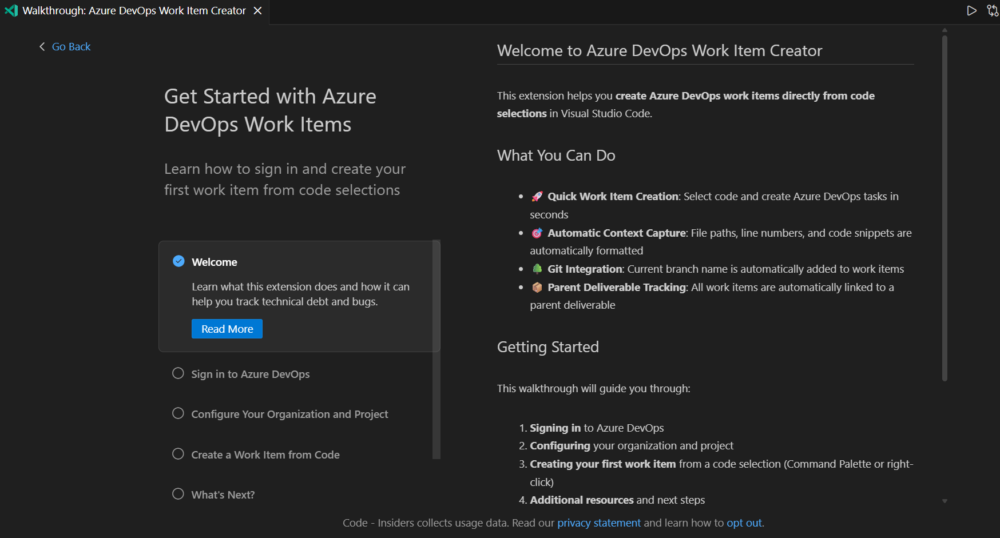

# Azure DevOps Quick Work Items

Create Azure DevOps work items directly from code selections in Visual Studio Code. Capture technical debt, bugs, and tasks as you encounter them in your codebase without leaving your editor.


<span aria-label="Screenshot showing: User selects code in VS Code editor, right-clicks, selects 'Create Azure DevOps Work Item', enters title and description, and success notification appears with 'Open Work Item' and 'Open Parent' buttons"></span>

## ✨ Features

- **🚀 Quick Work Item Creation**: Select code and create Azure DevOps tasks in seconds
- **🎯 Automatic Context Capture**: File paths, line numbers, and code snippets are automatically formatted in HTML
- **🌳 Git Integration**: Current branch name is automatically added to work items
- **📦 Parent Deliverable Tracking**: All work items are automatically linked to a parent deliverable for easy tracking
- **🔗 Multi-Selection Support**: Create a single work item from multiple code selections across different files
- **🔐 Seamless Authentication**: Uses VS Code's built-in Microsoft authentication (SSO supported, no PATs required)
- **🛡️ Reliable**: Automatic retry logic with exponential backoff for network resilience
- **🔄 Smart Caching**: Remembers parent deliverable across sessions, verifies it still exists

## 📦 Installation

1. Install the extension from the VS Code Marketplace
2. Open VS Code
3. Run the command **"Create Azure DevOps Work Item"** or **"Configure Azure DevOps Settings"** to trigger initial setup


<span aria-label="Screenshot showing: Setup wizard with three input prompts - Organization name, Project name, and Area Path (optional)"></span>

## 🚀 Quick Start

### Initial Setup

1. **Authenticate**: The extension will prompt you to sign in with your Microsoft account
   
   
   <span aria-label="Screenshot showing: VS Code authentication dialog 'Azure DevOps Work Item Creator wants to sign in using Microsoft' with 'Allow' button"></span>

2. **Configure Settings**: Enter your Azure DevOps details:
   - **Organization**: Your Azure DevOps organization name (e.g., `microsoft` for `https://dev.azure.com/microsoft/`)
   - **Project**: Your project name (e.g., `DefenderCommon`)
   - **Area Path** (Optional): Specific area path if you have restricted permissions

   
   <span aria-label="Screenshot showing: Three VS Code input prompts filled in - Organization: 'microsoft', Project: 'DefenderCommon', Area Path: 'OS\\WDATP\\Windows Cyber Defense\\Seville\\SOC Copilot\\Idan's Team'"></span>

### Creating Your First Work Item

1. **Select Code**: Highlight any code snippet in your editor
   
   
   <span aria-label="Screenshot showing: VS Code editor with a TypeScript function selected/highlighted in blue"></span>

2. **Open Context Menu**: Right-click on the selection
   
   
   <span aria-label="Screenshot showing: Right-click context menu with 'Create Azure DevOps Work Item' option highlighted"></span>

3. **Enter Title**: Provide a descriptive title for the work item
   
   
   <span aria-label="Screenshot showing: VS Code input box at top of editor with placeholder 'Enter work item title' and example text 'Refactor calculateTotal to handle null items'"></span>

4. **Add Context** (Optional): Add additional description or context
   
   
   <span aria-label="Screenshot showing: VS Code input box with placeholder 'Additional context (optional)' and example text 'Need to add null checking and improve error handling'"></span>

5. **Work Item Created!**: The URL is copied to your clipboard and a notification appears
   
   
   <span aria-label="Screenshot showing: VS Code info notification 'Copied to clipboard' with two buttons - 'Open Work Item' and 'Open Parent'"></span>

### View in Azure DevOps

Click **"Open Work Item"** to see your newly created task with formatted code snippets:


<span aria-label="Screenshot showing: Azure DevOps work item page with formatted sections - Context heading, Branch heading with code-formatted branch name, Code Snippets heading with syntax-highlighted code blocks showing file paths and line numbers, and a Links tab showing parent deliverable relationship"></span>

### Parent Deliverable Tracking

All work items are automatically linked to a parent deliverable titled "Quick WIs" for easy tracking:


<span aria-label="Screenshot showing: Azure DevOps deliverable work item titled 'Quick WIs' with Related Work section showing multiple child work items linked underneath"></span>

## 🎯 Usage

### Creating a Work Item

1. Select code in your editor (single or multiple selections)
2. Right-click and choose **"Create Azure DevOps Work Item"** (or use Command Palette: `Ctrl+Shift+P` / `Cmd+Shift+P`)
3. Enter a title for the work item
4. (Optional) Add additional context/description
5. The work item is created and the URL is copied to your clipboard
6. Click "Open in browser" to view it in Azure DevOps

### Example

Selecting this code:

```typescript
export function calculateTotal(items: Item[]): number {
  return items.reduce((sum, item) => {
    return sum + item.price * item.quantity;
  }, 0);
}
```

Creates a work item with description:

````
File: src/utils/helper.ts (Lines 45-52)
```typescript
export function calculateTotal(items: Item[]): number {
  return items.reduce((sum, item) => {
    return sum + item.price * item.quantity;
  }, 0);
}
````

Branch: feature/refactor-calculations

```

### Commands

- **Create Azure DevOps Work Item** - Create a work item from selected code
- **Configure Azure DevOps Settings** - Change organization/project or re-authenticate

## ⚙️ Configuration

Access settings through:
- Command Palette: **"Configure Azure DevOps Settings"**
- VS Code Settings UI: Search for "Azure DevOps"
- Settings JSON: Edit directly

### Available Settings

| Setting | Description | Example |
|---------|-------------|---------|
| `azureDevOps.organization` | Azure DevOps organization name | `microsoft` |
| `azureDevOps.project` | Project name within the organization | `DefenderCommon` |
| `azureDevOps.areaPath` | Optional area path for permissions | `OS\\WDATP\\Seville` |
| `azureDevOps.defaultWorkItemType` | Work item type (default: Task) | `Task` |

### URL Formats Supported

- Modern: `https://dev.azure.com/{organization}/{project}`
- Legacy: `https://{organization}.visualstudio.com/{project}`

Both formats are automatically detected and supported.

## 🎨 Work Item Format

Work items are created with HTML formatting for proper display in Azure DevOps:

### Structure
- **Context** (if provided): User-supplied description
- **Branch** (if available): Git branch name in code formatting
- **Code Snippets**: Formatted code blocks with:
  - File path and line numbers
  - Syntax highlighting
  - Proper HTML escaping

### Example Output

```html
<h3>Context</h3>
<p>Need to add null checking and improve error handling</p>

<h3>Branch</h3>
<p><code>feature/refactor-calculations</code></p>

<h3>Code Snippets</h3>
<strong>File:</strong> src/utils/helper.ts (Lines 45-52)<br>
<pre><code class="language-typescript">
export function calculateTotal(items: Item[]): number {
  return items.reduce((sum, item) =&gt; {
    return sum + item.price * item.quantity;
  }, 0);
}
</code></pre>
```

## 🔧 Advanced Features

### Multiple Code Selections

Select code from different parts of the same file or across multiple files. All selections will be included as separate code snippets in a single work item.


<span aria-label="Screenshot showing: VS Code editor with 3 different code blocks highlighted in blue across different sections of the file"></span>

### Parent Deliverable Management

The extension automatically:
1. Creates a parent deliverable titled "Quick WIs" on first use
2. Links all subsequent work items to this parent
3. Stores the parent ID in workspace state
4. Verifies the parent still exists before each use
5. Recreates the parent if it was deleted

This allows you to easily:
- Track all quick work items in one place
- Filter work items by parent in Azure DevOps queries
- Organize technical debt and bugs

### Area Path Configuration

If you have restricted permissions in Azure DevOps, configure an Area Path you have access to:

```json
{
  "azureDevOps.areaPath": "OS\\WDATP\\Windows Cyber Defense\\Seville\\SOC Copilot"
}
```

The parent deliverable and all work items will be created in this area.

## 🐛 Troubleshooting

### Authentication Issues

**Problem**: "Authentication failed" or "Unauthorized" errors

**Solutions**:
1. Run **"Configure Azure DevOps Settings"** command to re-authenticate
2. Ensure you're signed in with the correct Microsoft account
3. Verify you have access to the organization and project

### Parent Deliverable Errors

**Problem**: "Failed to create parent deliverable" with HTTP 400

**Solution**: The "Deliverable" work item type may not exist in your project. The extension will automatically fall back to "Epic" type.

### Work Item Not Linked to Parent

**Problem**: Work item created but no parent link visible

**Check Developer Console** (Help → Toggle Developer Tools → Console):
- Look for logs starting with `-----`
- Verify parent deliverable ID is shown
- Check if parent link URL is correct

### Network Errors

**Problem**: "Unable to reach Azure DevOps"

**Solutions**:
- Check internet connection
- Verify Azure DevOps is accessible (try opening in browser)
- The extension will automatically retry 3 times with exponential backoff

### Permissions Errors (TF237111)

**Problem**: "You do not have permissions to create work items"

**Solutions**:
1. Configure an Area Path you have access to in settings
2. Contact your Azure DevOps admin to grant "Create work items" permission
3. Verify your organization and project names are correct

## 📊 Developer Console Logs

All extension operations are logged with a `----- ` prefix for easy filtering:

```
----- Getting or creating parent deliverable
----- Found existing parent deliverable ID in state: 12345
----- Verifying parent deliverable still exists...
----- Parent deliverable 12345 verified, using it
----- Parent URL: https://dev.azure.com/microsoft/DefenderCommon/_workitems/edit/12345
----- Git branch name: feature/improve-logging
----- Added branch section to description
----- Description length: 2847 characters
----- Adding parent link to work item 12345
----- Parent work item URL: https://dev.azure.com/microsoft/_apis/wit/workItems/12345
----- Work item created successfully with ID: 67890
```

## 🔒 Privacy & Security

This extension:
- ✅ Uses VS Code's secure credential storage for authentication tokens
- ✅ Supports Microsoft SSO (Single Sign-On)
- ✅ Only communicates with official Azure DevOps APIs
- ✅ Does NOT collect telemetry or usage data
- ✅ Does NOT share your code or data with third parties
- ✅ Stores configuration in VS Code user settings (encrypted)

## 📝 Commands

| Command | Keyboard Shortcut | Description |
|---------|------------------|-------------|
| **Create Azure DevOps Work Item** | Right-click context menu | Create work item from code selection |
| **Configure Azure DevOps Settings** | Command Palette | Update organization/project/area path |

## 🔄 Requirements

- **VS Code**: Version 1.75.0 or higher
- **Azure DevOps**: Account with access to at least one project
- **Permissions**: "Create work items" permission in your project
- **Network**: Internet connection to reach Azure DevOps APIs

## 🚧 Known Limitations

- Only creates **Task** work items (Bugs, User Stories coming in future versions)
- Single organization/project configuration (no workspace-specific settings yet)
- No offline mode (requires internet connection)
- Parent deliverable is shared across all work items in the org/project

## 🗺️ Roadmap

Future enhancements planned:
- [ ] Support for Bug, User Story, and custom work item types
- [ ] Configurable fields (Tags, Iteration, Priority, etc.)
- [ ] Workspace-specific configurations
- [ ] Bulk work item creation
- [ ] Work item templates
- [ ] Integration with VS Code Tasks

## 🤝 Contributing

Contributions are welcome! Please:
1. Fork the repository
2. Create a feature branch
3. Submit a pull request

## 📄 License

MIT License - see [LICENSE](LICENSE) file for details.

## 🙋 Support

- **Issues**: [GitHub Issues](https://github.com/m-tantan/vsc-quick-ado-wi/issues)
- **Source**: [GitHub Repository](https://github.com/m-tantan/vsc-quick-ado-wi)
```
